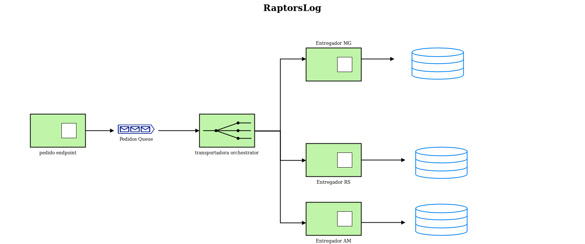

# Raptorslog  
Projeto de microservices para estudo de service mesh e sidecars com Istio e Envoy  

# Semântica  

* Dado uma loja que realiza 100 ou mais vendas por minuto com entrega apenas em 3 estados, AM, MG e RS.

* Dado uma transportadora que coleta as vendas e delega aos entregadores correspondentes ao estado do pedido.

* Dado entregador de AM que realiza a entrega em 1s.

* Dado entregador de MG que realiza a entrega em 2s.

* Dado entregador de RS que realiza a entrega em 3s.

# Regras  

* Cada serviço serviço separado em imagen docker.

* Usar serviço de fila entre Loja e Transportadora.

* Utilizar minikube na orquestração de microservices.

  

# Docs  

https://kubernetes.io/docs/tasks/tools/install-minikube/  
https://helm.sh/docs/  
https://istio.io/docs  